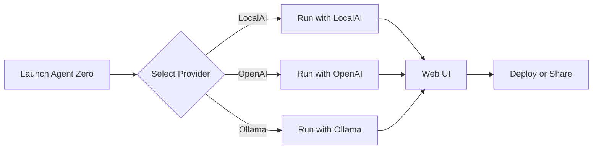

# Agent Zero Features and Workflows

This guide provides a high level overview of all major features in Agent Zero and how they fit together. Use the links below to dive deeper into each topic.

- [Installation](installation.md)
- [Usage Guide](usage.md)
- [Architecture Overview](architecture.md)
- [MCP Setup](mcp_setup.md)
- [Tunnel Feature](tunnel.md)

## Core Workflow



Agent Zero can operate with local models like LocalAI or Ollama as well as remote APIs such as OpenAI or OpenRouter. Once configured, interact with the agent through the Web UI or CLI and export results for deployment.

## Deploying to a Server

1. Ensure Docker is installed on the target server.
2. Copy your Agent Zero data directory to the server.
3. Run the provided Docker image:
   ```bash
   docker run -p 50080:80 -v /path/to/data:/a0 frdel/agent-zero-run
   ```
4. Access the web interface at `http://SERVER_IP:50080`.

### Docker Compose Example

```yaml
version: '3'
services:
  agent-zero:
    image: frdel/agent-zero-run:latest
    volumes:
      - ./data:/a0
    ports:
      - "50080:80"
```

Deploying via Docker Compose allows for easy updates and restarts. Adjust the volume path and ports as needed.
